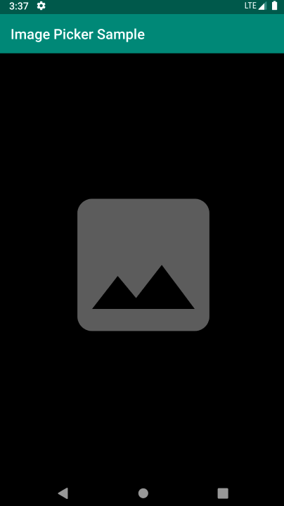

## ImagePicker

[](https://jitpack.io/#kikappsmx/imagepicker)

ImagePicker is a simple library designed to pick images from camera or gallery.



## Sample Project

To run the `Image Picker Sample` project:

1. Clone the repo with the following command:

    `git clone git@github.com:kikappsmx/imagepicker.git`

2. Import the project using Android Studio

    `Run the app `

## Download

Gradle
```
allprojects {
    repositories {
        maven { url 'https://jitpack.io' }
    }
}
```

```
dependencies {
    implementation 'com.github.kikappsmx:imagepicker:1.0'
}
```

## Usage

Create a new ImagePicker instance.
```
private val imagePicker by lazy { ImagePicker(context, listener) }

override fun onActivityResult(requestCode: Int, resultCode: Int, data: Intent?) {
    super.onActivityResult(requestCode, resultCode, data)
    imagePicker.onActivityResult(requestCode, resultCode, data)
}

override fun onRequestPermissionsResult(requestCode: Int, permissions: Array<out String>, grantResults: IntArray) {
    super.onRequestPermissionsResult(requestCode, permissions, grantResults)
    imagePicker.onRequestPermissionsResult(requestCode, grantResults)
}

private val listener = object: ImagePickerListener {

    override fun onImageSelected(bitmap: Bitmap) {
        //Do something with the bitmap
    }

    override fun onPermissionDenied() {
        //Give feedback about this action
    }

    override fun onPermissionBlocked() {
        //Give feedback about this action
    }
}
```

## License
```
Copyright 2019 Kikappsmx

Licensed under the Apache License, Version 2.0 (the "License");
you may not use this file except in compliance with the License.
You may obtain a copy of the License at

   http://www.apache.org/licenses/LICENSE-2.0

Unless required by applicable law or agreed to in writing, software
distributed under the License is distributed on an "AS IS" BASIS,
WITHOUT WARRANTIES OR CONDITIONS OF ANY KIND, either express or implied.
See the License for the specific language governing permissions and
limitations under the License.
```